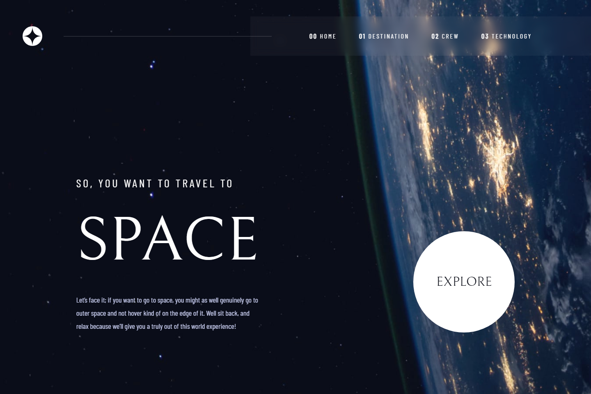
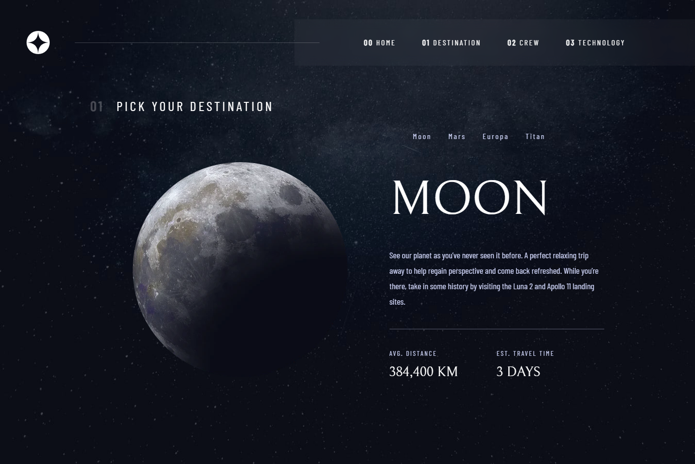
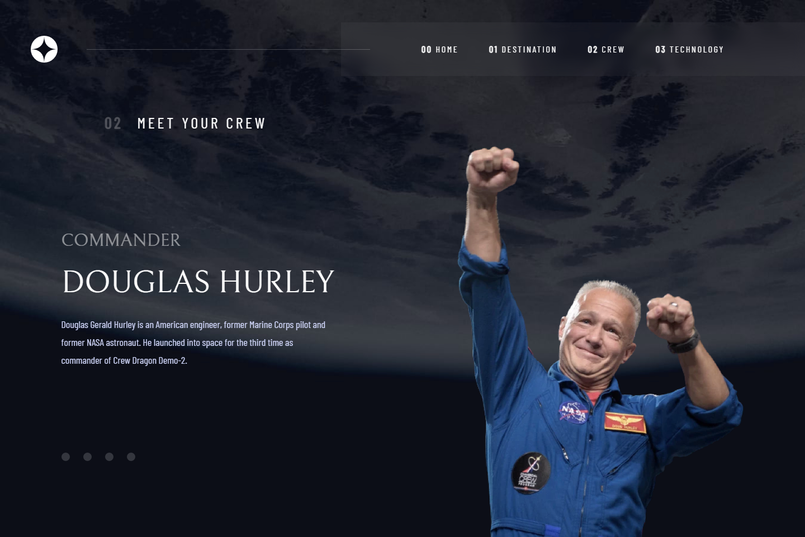
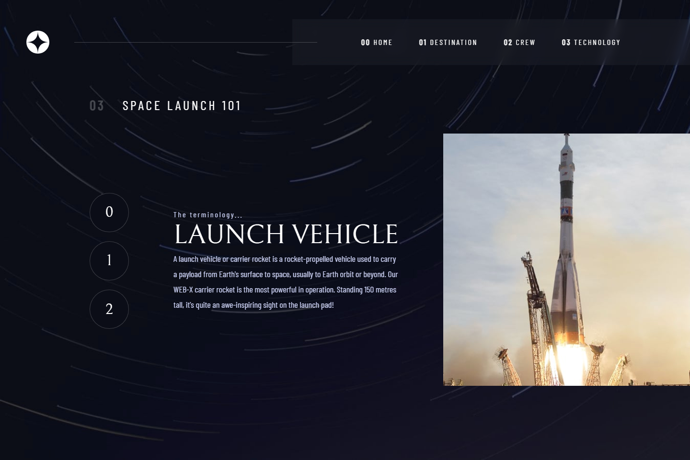

# Frontend Mentor - Space tourism website solution

This is a solution to the [Space tourism website challenge on Frontend Mentor](https://www.frontendmentor.io/challenges/space-tourism-multipage-website-gRWj1URZ3).

**Note that this page is optimized for desktop with the width of 1440px. Only the landing page is responsive.**

## Table of contents

- [Overview](#overview)
  - [The challenge](#the-challenge)
  - [Links](#links)
  - [Screenshots](#screenshot)
- [My process](#my-process)
  - [Built with](#built-with)
  - [What I learned](#what-i-learned)
  - [Continued development](#continued-development)
  - [Useful resources](#useful-resources)

## Overview

### The challenge

Users should be able to:

- ~~View the optimal layout for each of the website's pages depending on their device's screen size~~
- See hover states for all interactive elements on the page
- View each page and be able to toggle between the tabs to see new information

### Links

- Live Site URL: [jesper-helin.github.io/space-tourism/](https://jesper-helin.github.io/space-tourism/)

### Screenshot

## My process

### Built with

- React - JS library
- Flexbox - CSS layout
- Sass - CSS preprocessor

### What I learned

During this project, I got more familiar with a creating routing for pages. I learned the importance of going **mobile** first, and adding to the page after that, rather than the other way around. That's solely the reason why this page is optimized for desktop. 

### Continued development

Going forward, I plan on taking larger projects, that require thinking in advance about the layout and design of the website. I'm going to start working first on smaller screen sizes, and only after that will I move on to bigger screen sizes. I feel like I didn't use SASS to its fullest, but I'll be sure to practice it to reach the full potential of it.

### Useful resources

- [Dynamic image importing](https://stackoverflow.com/questions/53775936/import-image-dynamically-in-react-component) - This helped me to get each image to load dynamically. I used this to load the planets, crew, and technology images.